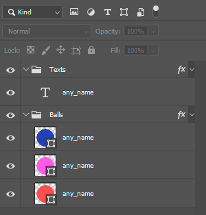
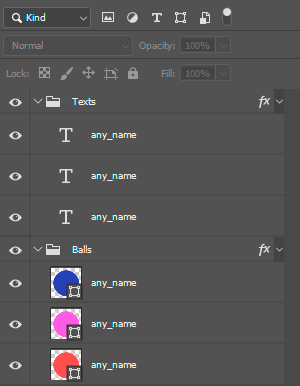
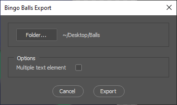
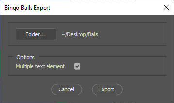
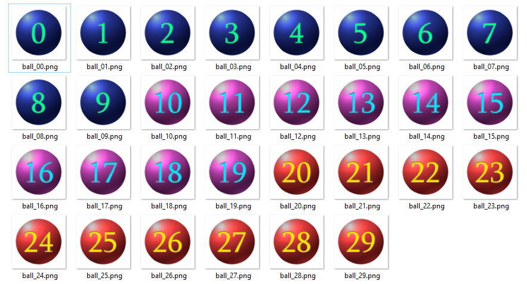

### Bingo Balls Export
This script was created to automate the exporting of bingo balls sprites using Photoshop. It allows to export a large number of sprites at once, instead exporting one by one, or using any other inconsistent method. It is easy to set up and to use!

#### Setting up the Layers
It is possible to export all groups of balls using the same text element(1), or export each group with its own text element(2).
(1)
(2)

Indifferent to the method, the script need to reconize 2 important elements: the balls and the text element.
- All balls must be inside a group named as "Balls";
- All texts elements (in case '1' just one element) must be inside a group named as "Texts";

(1)
(2)

When executing the script, a window with two fields will appear:
- The **Folder** field: choose the folder where all balls sprites are going to be exported;
- The **Multiple Text** field: if unchecked, the first text element inside the 'Texts' group will be exported with every ball. If checked, each ball group will be exported using a unique text element, so the amount of texts elements inside the 'Texts' group, must be the same amount of balls inside the 'Balls' group;

(1)
(2)

By completing the fields and pressing the 'Export' button, the process will begin and the files will be exported to the selected folder.

