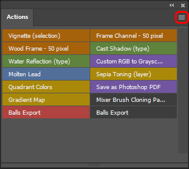
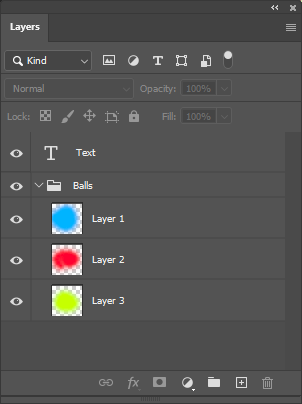

### Bingo Balls Export
The script was created to automate the exporting of bingo balls sprites for video bingo games using Photoshop. Running this script allows to export a large number of balls sprites at once, instead exporting one by one, or using any other inconsistent method. Easy to setting up and to use.

#### Seting up the Script
First, we are setting up the script to make easier to use it multiple times. Start by dowloading the *ball-export.jsx* file and place it in a folder of your choice, just remenber where it is saved. Now, inside Photoshop, let's create an action. If the actions window is not displayed, just go to "windows", then "actions". Click in the "plus" icon to add a new action, name it as you like and press "Record". From now on the Photoshop is recording every single action, so **click only the buttons that are required!** Click "*Files*" > "*Script*" > "*Browser*", search and select the *jsx* file. The script will start running, but just click "Cancel". Finally click the "square icon" in the actions window to stop recording. Click in the "hamburguer menu" in the top right corner of the action window and turn on the "Button Mode".

 
 

And its done! Every time you click this action, the script is going to run without the need to find it every time.

#### Setting up the Layers
Some requirement are needed for the process to work:
- The text layer that goes over tha balls must to be named as "Text" (case sensitive);
- All balls variants must be in a group named "Balls" (case sensitive) and the group must be under the text;

When executing the script, a window with two field will appear:
- The **Folder** field -> choose the folder where all balls sprites are going to be exported;
- The **Balls amount per variant** -> each ball layer is considered a variant, the toppest ball layer will be the fist variant of balls, the second will be the second variant and so on. So if you choose the "amount of ball per variant" to be 10, the 1-9 balls gonna be blue (first variant), the 10-19 balls gonna be red (second variant)... Keep 10 by default.

By completing the fields, the process will start and the files will be exported to the selected folder.